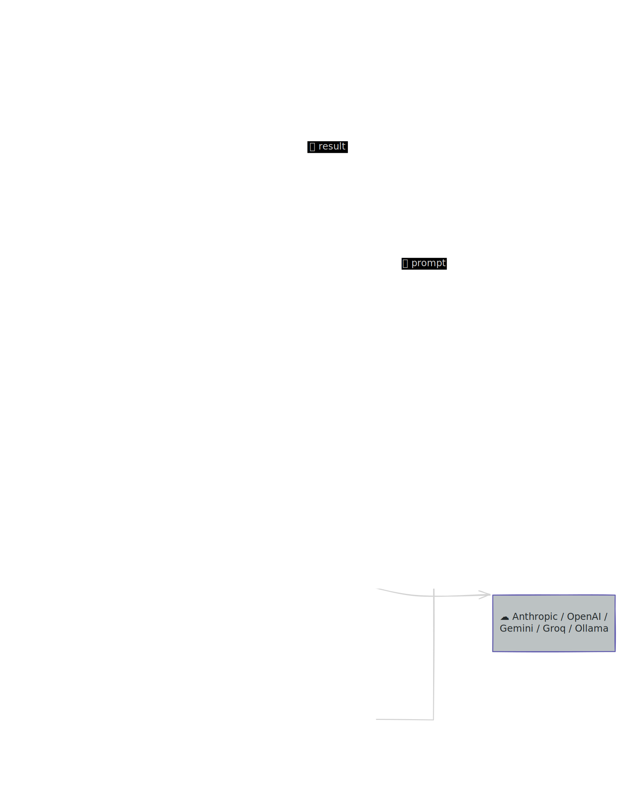

<p align="center">
  
</p>

<p align="center">
  <strong>Self-hosted AI assistant with multi-channel support, scheduled tasks, and extensible skills.</strong>
</p>

<p align="center">
  
  
  
  
</p>

---

## What is CianaParrot?

CianaParrot is a minimal but complete AI personal assistant that runs on your own infrastructure. It combines interactive chat via Telegram (and other channels) with autonomous scheduled tasks — all configured through a single YAML file.

**Key features:**
- **Multi-provider LLM** — Anthropic, OpenAI, Google Gemini, Groq, Ollama, OpenRouter, vLLM
- **Multi-channel** — Pluggable architecture, Telegram out of the box
- **Host bridge system** — Forward messages to CLI tools running on the host (Claude Code built in, extensible to others)
- **Scheduled tasks** — Cron, interval, and one-shot tasks
- **Web tools** — Search (Brave / DuckDuckGo) and URL fetching built in
- **Skills system** — Add a folder in `skills/` with a `SKILL.md` and a `skill.py`, and it auto-registers
- **MCP support** — Connect external MCP servers for unlimited extensibility
- **Persistent memory** — Markdown-based identity and memory the agent updates itself
- **Observability** — Optional LangSmith tracing for debugging and monitoring
- **Docker-only deploy** — One command to build, one to run

## Architecture

<p align="center">
  
</p>


## Quick Start

### 1. Clone and configure

```bash
git clone https://github.com/your-user/ciana-parrot.git
cd ciana-parrot
cp .env.example .env
```

Edit `.env` with your keys:

```
ANTHROPIC_API_KEY=sk-ant-...
TELEGRAM_BOT_TOKEN=123456:ABC-DEF...
```

> **Telegram bot token:** Message [@BotFather](https://t.me/BotFather) on Telegram, send `/newbot`, and follow the prompts.

### 2. Build and run

```bash
make build
make up
```

### 3. Chat

Open your bot on Telegram, send `/start`, and start chatting.

## Project Structure

```
cianaparrot/
├── config.yaml              # Single config file
├── .env                     # Secrets (API keys, tokens)
├── Dockerfile
├── docker-compose.yml
├── Makefile                 # build, up, down, logs, restart, shell, test
├── src/
│   ├── main.py              # Entry point, event loop, wiring
│   ├── agent.py             # DeepAgents setup, tools, memory
│   ├── agent_response.py    # Response extraction from LangGraph messages
│   ├── config.py            # YAML loader with ${ENV_VAR} expansion
│   ├── events.py            # Shared event types (tool calls, thinking, text)
│   ├── router.py            # Trigger detection, auth, thread mapping
│   ├── scheduler.py         # Cron/interval/once task runner
│   ├── store.py             # JSON file-backed key-value store
│   ├── utils.py             # Text truncation utilities
│   ├── channels/
│   │   ├── base.py          # AbstractChannel interface
│   │   └── telegram/
│   │       ├── channel.py   # Telegram adapter + mode handler system
│   │       ├── formatting.py# Markdown → Telegram HTML conversion
│   │       ├── rendering.py # Tool display, sub-agent collapsing, icons
│   │       ├── utils.py     # Typing indicator
│   │       └── handlers/
│   │           └── claude_code.py  # Claude Code mode handler
│   ├── bridges/
│   │   └── claude_code/
│   │       ├── bridge.py    # CC session management, CLI execution, NDJSON parsing
│   │       └── server.py    # Host-side HTTP bridge server
│   └── tools/
│       ├── web.py           # Web search + URL fetch
│       └── cron.py          # Schedule/list/cancel tasks
├── workspace/
│   ├── IDENTITY.md          # Agent persona (name, tone, style)
│   ├── AGENT.md             # Behavioral instructions
│   ├── MEMORY.md            # Persistent memory (agent-updated)
│   └── sessions/            # JSONL conversation logs
├── skills/                  # Drop-in skill modules
└── data/
    ├── scheduled_tasks.json # Persisted scheduled tasks
    └── allowed_users.json   # Per-channel user allowlist
```

## Configuration

Everything lives in `config.yaml`. Secrets are referenced as `${ENV_VAR}` and expanded from `.env` at runtime. Config is validated at startup using Pydantic v2 models.

### LLM Provider

Change provider by editing two lines:

```yaml
provider:
  name: "anthropic"              # anthropic | openai | google-genai | groq | ollama
  model: "claude-sonnet-4-6"     # any model the provider supports
  api_key: "${ANTHROPIC_API_KEY}"
```

<details>
<summary><strong>All supported providers</strong></summary>

| Provider | `name` | Example `model` | Env var |
|---|---|---|---|
| Anthropic | `anthropic` | `claude-sonnet-4-6` | `ANTHROPIC_API_KEY` |
| OpenAI | `openai` | `gpt-4o` | `OPENAI_API_KEY` |
| Google Gemini | `google-genai` | `gemini-2.0-flash` | `GOOGLE_API_KEY` |
| Groq | `groq` | `llama-3.3-70b-versatile` | `GROQ_API_KEY` |
| Ollama (local) | `ollama` | `llama3` | — |
| OpenRouter | `openai` | `anthropic/claude-sonnet-4-5` | `OPENROUTER_API_KEY` |
| vLLM | `openai` | `your-model` | — |

For OpenRouter, Ollama, and vLLM add `base_url`:

```yaml
provider:
  name: "openai"
  model: "anthropic/claude-sonnet-4-5"
  api_key: "${OPENROUTER_API_KEY}"
  base_url: "https://openrouter.ai/api/v1"
```

</details>

<details>
<summary><strong>Additional provider options</strong></summary>

```yaml
provider:
  temperature: 0         # 0.0–2.0
  max_tokens: 8192       # Max tokens per response
```

</details>

### Agent

```yaml
agent:
  workspace: "./workspace"       # Root directory for agent files
  max_tool_iterations: 20        # Max tool calls per turn (default: 20)
```

### Channels

```yaml
channels:
  telegram:
    enabled: true
    token: "${TELEGRAM_BOT_TOKEN}"
    trigger: "@Ciana"        # Required prefix in group chats (ignored in DMs)
    allowed_users: []        # Empty = everyone allowed
```

### Web Tools

```yaml
web:
  brave_api_key: "${BRAVE_API_KEY}"  # Optional, falls back to DuckDuckGo
  fetch_timeout: 30                  # URL fetch timeout in seconds
```

### MCP Servers

Connect external tools via [Model Context Protocol](https://modelcontextprotocol.io):

```yaml
mcp_servers:
  filesystem:
    transport: "stdio"
    command: "npx"
    args: ["-y", "@modelcontextprotocol/server-filesystem", "/data"]

  custom_api:
    transport: "sse"
    url: "http://localhost:8080/sse"
```

### Scheduled Tasks

The agent can create scheduled tasks via chat (e.g., "remind me every Monday at 9am to check reports"). Tasks are persisted in `data/scheduled_tasks.json`.

```yaml
scheduler:
  enabled: true
  poll_interval: 60              # Seconds between task checks
  data_file: "./data/scheduled_tasks.json"
```

### Logging

```yaml
logging:
  level: "INFO"                  # DEBUG | INFO | WARNING | ERROR
```

## Host Bridge System

CianaParrot includes a **bridge architecture** that lets the Dockerized bot forward messages to CLI tools running on the host machine. The bot sends HTTP requests to a lightweight bridge server running outside Docker, which executes commands locally and returns results.

This pattern is useful for any tool that needs direct host access — native CLIs, local development tools, or services that can't run inside the container.

**Built-in bridge: Claude Code** — talk to [Claude Code](https://docs.anthropic.com/en/docs/claude-code) directly from Telegram, with project/conversation management, tool-use visualization, and session persistence.

The bridge system is extensible: the same HTTP bridge + mode handler pattern can be reused to integrate other host-side tools.

### How it works

1. The user enters a **mode** in Telegram (e.g., `/cc` for Claude Code)
2. Messages are intercepted by the mode handler instead of going to the main agent
3. The mode handler calls the bridge, which makes an HTTP request to the host
4. The host bridge server executes the CLI command and returns the output
5. The response is parsed and rendered back in Telegram with tool details, thinking indicators, and sub-agent collapsing

### Claude Code Bridge

#### Setup

1. **Install Claude Code** on the host machine ([installation guide](https://docs.anthropic.com/en/docs/claude-code))

2. **Add a bridge token** to `.env`:
   ```
   CC_BRIDGE_TOKEN=any-secret-string-you-choose
   ```

3. **Enable in `config.yaml`**:
   ```yaml
   claude_code:
     enabled: true
     bridge_url: "http://host.docker.internal:9842"
     bridge_port: 9842
     bridge_token: "${CC_BRIDGE_TOKEN}"
     projects_dir: "/app/.claude-projects"
     permission_mode: "bypassPermissions"
     timeout: 0                    # 0 = no timeout
   ```

4. **Mount Claude projects** in `docker-compose.yml` (read-only, for project listing):
   ```yaml
   volumes:
     - ~/.claude/projects:/app/.claude-projects:ro
   ```

5. **Start the bridge** on the host:
   ```bash
   make bridge-cc
   ```

6. **Restart the bot**:
   ```bash
   make restart
   ```

#### Usage

| Command | Description |
|---------|-------------|
| `/cc` | Enter Claude Code mode — shows project list |
| `/cc exit` | Exit Claude Code mode |

Once in CC mode:
- **Select a project** from the paginated inline keyboard
- **Pick a conversation** to resume, or start a new one
- **Send messages** directly — they go to Claude Code instead of the main agent
- **Tool details** button expands to show each tool call with its output
- A persistent reply keyboard provides quick access to **Conversations** and **Exit CC**

The display groups consecutive tool calls (e.g., "Read 3 calls"), collapses sub-agent activity to a single line, and shows per-tool icons for readability.

### Adding a New Bridge

To integrate another host-side tool:

1. **Create a bridge module** in `src/bridges/your_tool/` — manages sessions and communicates with the host bridge server
2. **Create a mode handler** in `src/channels/telegram/handlers/` — implements the `ModeHandler` protocol (see `src/channels/telegram/channel.py`)
3. **Add a config section** in `config.yaml` and a Pydantic model in `src/config.py`
4. **Wire it up** in `src/main.py` via `channel.register_mode_handler()`

The existing HTTP bridge server (`server.py`) is generic — it accepts any `{cmd, cwd, timeout}` payload and returns `{stdout, stderr, returncode}`. You can reuse it as-is or extend it with new endpoints.

## Skills

Add capabilities by dropping a folder in `skills/`:

```
skills/
└── weather/
    ├── SKILL.md    # Description + instructions for the agent
    └── skill.py    # Python functions auto-registered as tools
```

```python
# skills/example/skill.py

def hello(name: str) -> str:
    """Say hello to someone."""
    return f"Hello, {name}!"
```

Functions with docstrings are auto-registered as agent tools by DeepAgents.

## User Access Control

Edit `data/allowed_users.json` to restrict who can use the bot:

```json
{
  "telegram": ["123456789", "987654321"]
}
```

Empty list = everyone allowed. Find your Telegram user ID via [@userinfobot](https://t.me/userinfobot).

## Commands

| Command | Description |
|---------|-------------|
| `/start` | Welcome message |
| `/help` | List all commands |
| `/new` | Reset conversation session |
| `/status` | System status |
| `/cc` | Enter Claude Code mode |
| `/cc exit` | Exit Claude Code mode |

## Observability

CianaParrot supports [LangSmith](https://smith.langchain.com/) for tracing and debugging agent execution. Add these to your `.env`:

```
LANGSMITH_API_KEY=lsv2_pt_...
LANGCHAIN_TRACING_V2=true
LANGCHAIN_PROJECT=ciana-parrot
```

All agent invocations (tool calls, LLM requests, memory operations) will appear as traces in LangSmith Studio.

## Makefile

```
make build      # Build Docker image
make up         # Start in background
make down       # Stop
make logs       # Follow logs
make restart    # Rebuild and restart
make shell      # Shell into container
make test       # Run test suite (pytest)
make bridge-cc  # Start Claude Code bridge on host (port 9842)
```

## Host Filesystem Access

The agent runs inside Docker and is sandboxed to the `workspace/` directory. To let it read or write files on your host machine, mount host directories as subdirectories of `workspace/` in `docker-compose.yml`:

```yaml
volumes:
  - ./workspace:/app/workspace
  - /path/to/your/folder:/app/workspace/host/folder-name
```

The agent can then access the files using its built-in tools (`ls`, `read_file`, `write_file`, etc.) at `host/folder-name/`.

### Read-only access

Append `:ro` to the volume mount to prevent the agent from modifying files:

```yaml
- ~/Documents:/app/workspace/host/documents:ro
```

### Read-write access

Omit the `:ro` suffix to allow the agent to create and edit files:

```yaml
- ~/Projects:/app/workspace/host/projects
```

### Example

```yaml
services:
  cianaparrot:
    volumes:
      - ./workspace:/app/workspace
      - ./data:/app/data
      - ./skills:/app/skills
      - ./config.yaml:/app/config.yaml:ro
      - ~/Documents:/app/workspace/host/documents:ro
      - ~/Projects:/app/workspace/host/projects
      - ~/Notes:/app/workspace/host/notes
```

After editing `docker-compose.yml`, restart with `make restart` (or `make build && make up` if you also changed the image).

## Customizing the Agent

The agent's behavior is fully controlled by three markdown files in `workspace/`:

| File | Purpose |
|------|---------|
| `IDENTITY.md` | Who the agent is — name, language, tone, personality |
| `AGENT.md` | How the agent behaves — tool usage rules, formatting guidelines |
| `MEMORY.md` | What the agent remembers — updated automatically across sessions |

Edit these files and restart. No code changes needed.

## Adding a New Channel

1. Create `src/channels/myservice/` as a package
2. Implement the `AbstractChannel` interface (`start`, `stop`, `send`, `send_file`, `on_message`)
3. Add config section in `config.yaml` and a Pydantic model in `src/config.py`
4. Wire it up in `src/main.py`

## License

MIT
