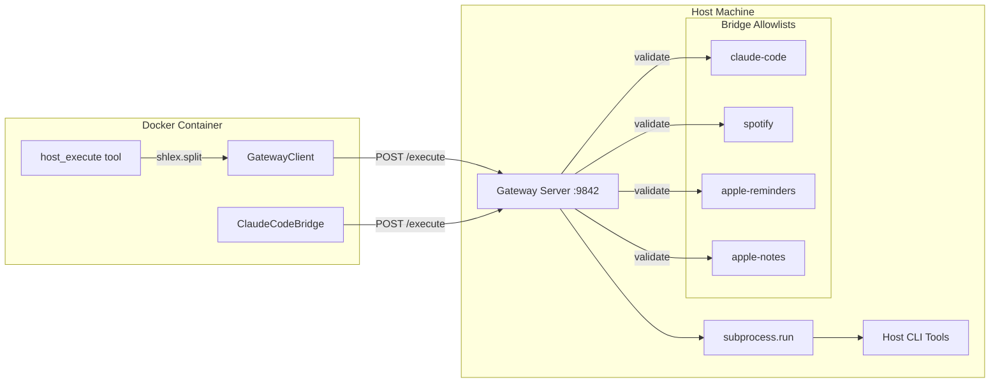
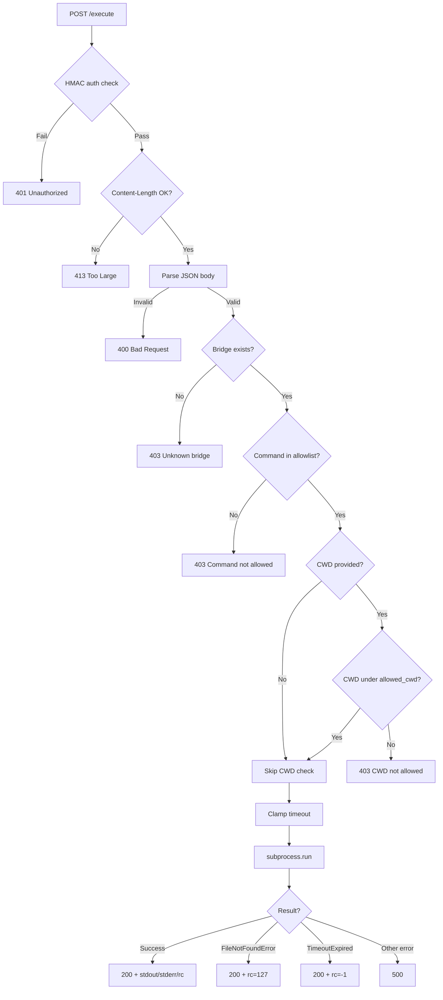
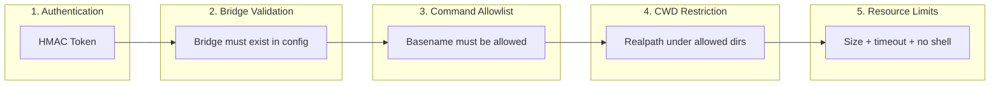
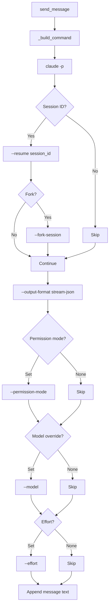
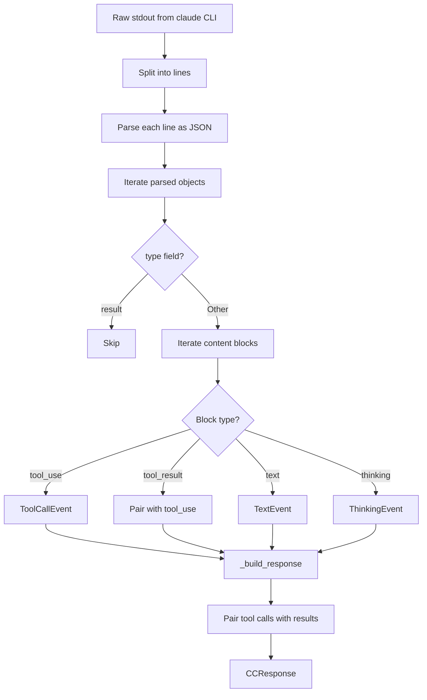
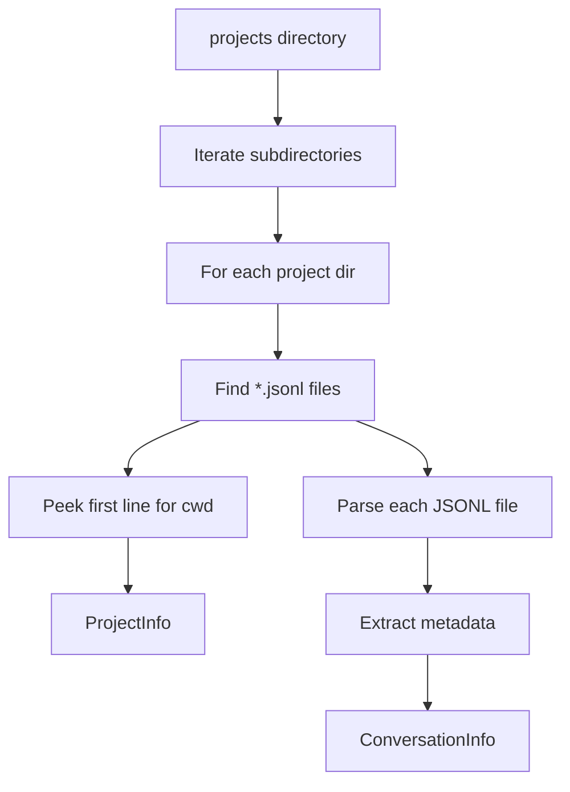

# Gateway System

The gateway bridges the Docker container to host-side CLI tools through a secure HTTP server. It enforces per-bridge command allowlists, directory restrictions, and HMAC token authentication.

## Architecture



## Gateway Server

**File**: `src/gateway/server.py`

The gateway runs on the host machine as a standalone Python process (`make gateway` or `python -m src.gateway.server`). It uses Python's `ThreadingHTTPServer` for simplicity.

### Endpoints

| Method | Path | Description |
|--------|------|-------------|
| `GET` | `/health` | Returns `{"status": "ok", "bridges": [...]}` with the list of configured bridge names |
| `POST` | `/execute` | Validates and executes a command. Returns `{"stdout": ..., "stderr": ..., "returncode": ...}` |

### Request Format

```json
{
    "bridge": "claude-code",
    "cmd": ["claude", "-p", "--output-format", "stream-json", "hello"],
    "cwd": "/Users/me/Projects/myapp",
    "timeout": 120
}
```

| Field | Type | Required | Description |
|-------|------|----------|-------------|
| `bridge` | string | Yes | Bridge name matching a key in `config.gateway.bridges` |
| `cmd` | list[string] | Yes | Command as a list of arguments (not a shell string) |
| `cwd` | string | No | Working directory on the host. Validated against bridge's `allowed_cwd` |
| `timeout` | number | No | Subprocess timeout in seconds. `0` = no limit (None). Capped at 600s |

### Response Format

**Success (200)**:
```json
{
    "stdout": "command output here",
    "stderr": "",
    "returncode": 0
}
```

**Command not found (200, returncode 127)**:
```json
{
    "stdout": "",
    "stderr": "Command 'claude' not found on host. Install it first.",
    "returncode": 127
}
```

**Timeout (200, returncode -1)**:
```json
{
    "stdout": "",
    "stderr": "Command timed out",
    "returncode": -1
}
```

**Validation errors**: HTTP 400 (bad request), 401 (auth), 403 (forbidden), 413 (body too large), 500 (server error).

### Request Validation Flow



## Security Model



- **HMAC token authentication**: The `GATEWAY_TOKEN` environment variable is required. Comparison uses `hmac.compare_digest()` to prevent timing attacks. The server refuses to start if no token is set.
- **Command basename validation**: Only the basename of `cmd[0]` is checked (via `os.path.basename()`), preventing path-based bypass attempts like `/usr/bin/../bin/dangerous`.
- **CWD path traversal prevention**: The `cwd` parameter is resolved to its real path (via `os.path.realpath()`) and must be equal to or a subdirectory of one of the bridge's `allowed_cwd` entries. This prevents symlink and `../` traversal attacks.
- **Content length limit**: Request bodies larger than 1 MB (`MAX_CONTENT_LENGTH = 1_048_576`) are rejected.
- **Timeout capping**: Timeouts are clamped to `MAX_TIMEOUT = 600` seconds. A timeout of 0 means no limit (subprocess runs until completion).
- **No shell execution**: Commands are executed via `subprocess.run()` with `shell=False` and a command list, preventing shell injection.
- **Environment sanitization**: `CLAUDE_CODE` and `CLAUDECODE` environment variables are removed before subprocess execution to prevent recursive Claude Code invocations.

## Gateway Client

**File**: `src/gateway/client.py`

The `GatewayClient` is an async HTTP client used inside the Docker container to communicate with the gateway server.

```python
@dataclass
class GatewayResult:
    stdout: str = ""
    stderr: str = ""
    returncode: int = 0
    error: str = ""
```

### Error Handling

| Scenario | Behavior |
|----------|----------|
| `httpx.ConnectError` | Returns `GatewayResult(error="Cannot connect to host gateway...")` |
| `httpx.TimeoutException` | Returns `GatewayResult(error="Gateway request timed out.")` |
| HTTP 401 | Returns `GatewayResult(error="Gateway auth failed. Check GATEWAY_TOKEN.")` |
| HTTP 403 | Returns `GatewayResult(error=<server error message>)` |
| Other HTTP errors | Returns `GatewayResult(error="Gateway returned HTTP {status}")` |

### HTTP Timeout Behavior

The HTTP client timeout is calculated based on the subprocess timeout:

- **timeout = 0** (no subprocess limit): HTTP timeout = `None` (no limit)
- **timeout > 0**: HTTP timeout = `timeout + 10` seconds (buffer for network overhead)

## host_execute Tool

**File**: `src/tools/host.py`

The `host_execute` tool is the LangChain `@tool` that the agent calls to run commands on the host. It acts as the front-end to `GatewayClient`.

```mermaid
flowchart TD
    A[Agent calls host_execute] --> B{Gateway configured?}
    B -->|No| C[Error: not configured]
    B -->|Yes| D{Bridge name valid?}
    D -->|No| E[Error: unknown bridge]
    D -->|Yes| F[shlex.split command]
    F -->|Invalid| G[Error: invalid syntax]
    F -->|Valid| H[GatewayClient.execute]
    H --> I{GatewayResult}
    I -->|error set| J[Return error]
    I -->|returncode != 0| K[Command failed]
    I -->|success| L[Return stdout]
    L --> M{Length > 15000?}
    M -->|Yes| N[Truncate + "... (truncated)"]
    M -->|No| O[Return as-is]
```

The tool takes a shell command string (not a list), parses it with `shlex.split()`, and validates the bridge name against `_available_bridges` before sending. Output is capped at `MAX_OUTPUT_LENGTH = 15_000` characters. If no timeout is specified (or timeout=0), it uses `_default_timeout` from the gateway config.

## Claude Code Bridge

**File**: `src/gateway/bridges/claude_code/bridge.py`

The `ClaudeCodeBridge` is a specialized bridge that manages Claude Code CLI interactions with per-user state.

### Per-User State

```python
@dataclass
class UserSession:
    mode: str = "ciana"                          # "ciana" or "claude_code"
    active_project: str | None = None            # Encoded project directory name
    active_project_path: str | None = None       # Real filesystem path
    active_session_id: str | None = None         # Claude Code session ID (UUID)
    active_model: str | None = None              # Model override (e.g., "sonnet")
    active_effort: str | None = None             # Effort level: low/medium/high
```

State is persisted in `data/cc_user_states.json` via `JsonStore` and restored on startup.

### Command Construction



### Execution Modes

The bridge supports two execution modes:

1. **Via gateway** (`_execute_via_bridge`): Sends the command through the HTTP gateway. Used when running in Docker.
2. **Local** (`_execute_local`): Runs the Claude Code CLI directly via `asyncio.create_subprocess_exec()`. Used for local development.

The mode is determined by whether `bridge_url` is configured.

### NDJSON Response Parsing



The bridge parses Claude Code's NDJSON (stream-json) output into structured events:

- **TextEvent**: Plain text assistant response
- **ToolCallEvent**: Tool invocation with input summary and result text, paired by `tool_use_id`
- **ThinkingEvent**: Extended thinking block content

These events are shared types (defined in `src/events.py`) used by both the normal agent response extraction and the Claude Code bridge, enabling a unified rendering pipeline in the Telegram channel.

### Project and Conversation Discovery

The bridge scans `~/.claude/projects/` (configurable via `claude_code.projects_dir`) to discover projects and conversations:



**ProjectInfo** is derived from the directory structure. The `real_path` is extracted by reading the `cwd` field from the first line of the most recent JSONL file.

**ConversationInfo** is parsed from each JSONL session file, extracting the first user message as a preview, the timestamp, message count, and git branch metadata.

### New Session Detection

When a user starts a new conversation (no `active_session_id`), the bridge snapshots existing session files before executing the command. After execution, it compares the directory listing to find the newly created JSONL file and records its stem as the `active_session_id`. This is persisted so subsequent messages resume the same session.

## Configuration

Bridge configuration lives in `config.yaml` under the `gateway` section:

```yaml
gateway:
  enabled: true
  url: "http://host.docker.internal:9842"
  token: "${GATEWAY_TOKEN}"
  port: 9842
  default_timeout: 30
  bridges:
    claude-code:
      allowed_commands: ["claude"]
      allowed_cwd: ["~/Projects", "~/Documents"]
    spotify:
      allowed_commands: ["spogo"]
      allowed_cwd: []
    apple-reminders:
      allowed_commands: ["reminders"]
      allowed_cwd: []
    apple-notes:
      allowed_commands: ["memo"]
      allowed_cwd: []
```

The `BridgeDefinition` Pydantic model validates each bridge:

```python
class BridgeDefinition(BaseModel):
    allowed_commands: list[str] = Field(default_factory=list)
    allowed_cwd: list[str] = Field(default_factory=list)
```

The Claude Code bridge has additional configuration under `claude_code`:

```yaml
claude_code:
  enabled: true
  bridge_url: ""          # Falls back to gateway.url
  bridge_token: ""        # Falls back to gateway.token
  projects_dir: "~/.claude/projects"
  permission_mode: ""     # e.g., "bypassPermissions"
  timeout: 0              # 0 = no limit
  claude_path: "claude"   # Path to claude CLI
  state_file: "data/cc_user_states.json"
```
