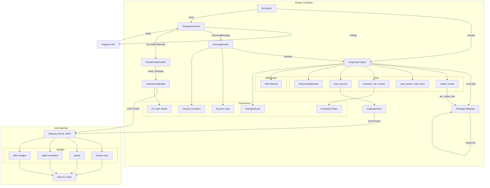
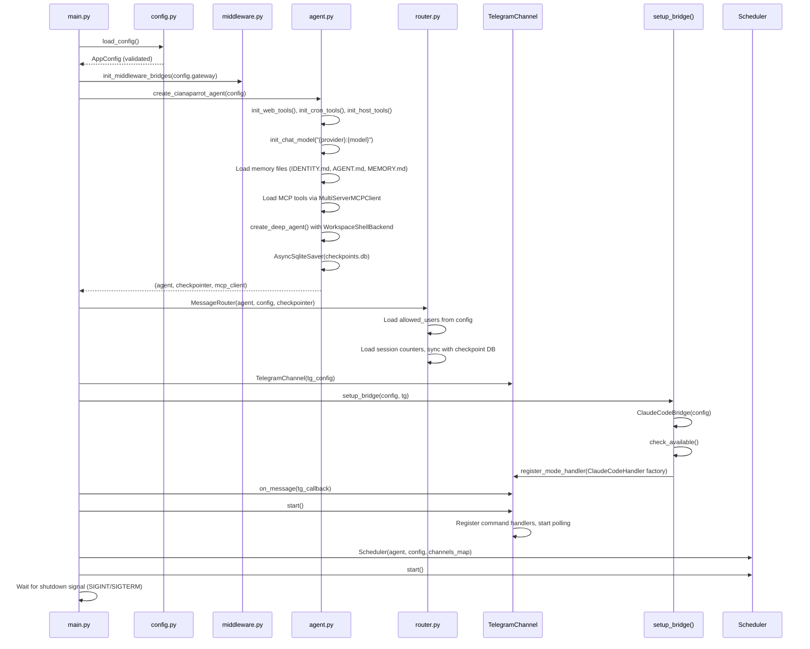

# Architecture Overview

CianaParrot is a self-hosted AI personal assistant built on the **DeepAgents** framework with LangChain/LangGraph. It combines interactive chat via Telegram with autonomous scheduled tasks, and bridges to host-side CLI tools through a secure HTTP gateway.

## System Architecture

## Component Table

| Component | Module | Description |
|-----------|--------|-------------|
| **TelegramChannel** | `src/channels/telegram/channel.py` | Receives messages via long polling, sends responses with Markdown-to-HTML conversion. Supports text, voice (with transcription), and photo messages. Pluggable mode handlers via `register_mode_handler()`. |
| **AbstractChannel** | `src/channels/base.py` | Base class defining the channel adapter interface: `start()`, `stop()`, `send()`, `send_file()`, `on_message()`. Also defines `IncomingMessage` and `SendResult` dataclasses. |
| **MessageRouter** | `src/router.py` | Routes incoming messages to the agent. Handles user allowlist checks, trigger detection (group chats require `@Ciana` prefix; DMs always respond), session resets (`/new`), thread ID mapping, and JSONL session logging. |
| **Agent** | `src/agent.py` | Creates the LangGraph agent via `create_deep_agent()` with LLM, memory files, skills, custom tools, and MCP tools. When `model_router` is enabled, uses `RoutingChatModel` as the LLM. Uses `WorkspaceShellBackend` for sandboxed file and shell operations. |
| **RoutingChatModel** | `src/tools/model_router.py` | `BaseChatModel` wrapper that delegates to the active tier's LLM. Uses a `ContextVar(_active_tier)` for per-task tier selection. `bind_tools()` pre-binds on all tiers and resolves dynamically. Injects tier info into the system message. |
| **WorkspaceShellBackend** | `src/backend.py` | Extends DeepAgents' `FilesystemBackend` with allowlisted shell execution. File tools are sandboxed to `workspace/` via `virtual_mode=True`. Shell commands restricted to a curated set (curl, python, git, jq, ffmpeg, etc.). |
| **Scheduler** | `src/scheduler.py` | Background asyncio task that polls `scheduled_tasks.json`. Supports three task types: `cron` (croniter expressions), `interval` (seconds), `once` (ISO timestamp). Executes tasks by invoking the agent (with optional `model_tier` via `set_active_tier`), then sends results to the originating channel/chat. |
| **Gateway Server** | `src/gateway/server.py` | HTTP server running on the host machine (port 9842). Validates requests against per-bridge command allowlists and cwd allowlists. Executes commands via `subprocess.run()`. HMAC token authentication. |
| **GatewayClient** | `src/gateway/client.py` | Async HTTP client (httpx) used inside Docker to call the gateway. Returns `GatewayResult` dataclass. Handles connection errors, timeouts, and HTTP status codes. |
| **host_execute tool** | `src/tools/host.py` | LangChain `@tool` that sends commands through `GatewayClient` to the host gateway. Validates bridge name against configured allowlists before sending. |
| **ClaudeCodeBridge** | `src/gateway/bridges/claude_code/bridge.py` | Manages per-user Claude Code sessions (project, session ID, model, effort). Communicates via gateway or local CLI. Parses NDJSON streaming output into structured events (`TextEvent`, `ToolCallEvent`, `ThinkingEvent`). |
| **ClaudeCodeHandler** | `src/channels/telegram/handlers/claude_code.py` | Telegram mode handler implementing the `ModeHandler` protocol. Handles `/cc` command, project/conversation selection via inline keyboards with pagination, message forwarding to the bridge, and `cc:` meta-commands. |
| **setup_bridge()** | `src/gateway/bridges/claude_code/__init__.py` | Factory function that creates the `ClaudeCodeBridge`, checks availability, and registers `ClaudeCodeHandler` as a mode handler on the Telegram channel. |
| **Middleware** | `src/middleware.py` | Patches DeepAgents' skill YAML parser to support `requires_env` and `requires_bridge` frontmatter fields. Skills whose required bridges or env vars are missing are filtered out at load time. |
| **Web Tools** | `src/tools/web.py` | `web_search` (Brave API or DuckDuckGo fallback) and `web_fetch` (URL to Markdown via markdownify). |
| **Cron Tools** | `src/tools/cron.py` | `schedule_task`, `list_tasks`, `cancel_task`. Uses module-level `ContextVar` to track originating channel/chat so scheduled tasks can send results back. Shared `asyncio.Lock` prevents races on the tasks JSON file. |
| **Model Router** | `src/tools/model_router.py` | `switch_model` tool (sets `_active_tier` ContextVar), `RoutingChatModel` (multi-tier LLM wrapper), `set_active_tier()`/`reset_active_tier()` helpers for scheduler. |
| **Config** | `src/config.py` | Loads `config.yaml` with `${ENV_VAR}` expansion. Validates with Pydantic v2 models (`AppConfig` and sub-models). Single source of truth for all configuration. |
| **JsonStore** | `src/store.py` | Simple JSON file-backed key-value store used for session counters and CC user states. Read-on-init, write-on-mutation. |
| **Events** | `src/events.py` | Shared event types (`ToolCallEvent`, `ThinkingEvent`, `TextEvent`) used by both normal agent responses and Claude Code bridge responses. Includes display name resolution and tool input summarization. |
| **AgentResponse** | `src/agent_response.py` | Extracts structured responses from LangGraph agent results. Pairs tool calls with their results, extracts thinking blocks and text blocks from the current turn's message history. |

## Startup Sequence

## Key Design Decisions

**Async-first architecture**: All I/O operations use `async def`. The Telegram channel uses manual polling (not `run_polling()`) to share the asyncio event loop with the agent and scheduler.

**Module-level tool initialization**: Tools follow a pattern where `init_*()` sets module-level globals at startup, then `@tool`-decorated functions read those globals. This avoids passing config through LangGraph's tool interface.

**Virtual filesystem sandboxing**: The agent's file operations are confined to the `workspace/` directory via `FilesystemBackend(virtual_mode=True)`. Host directories can be exposed by mounting them as subdirectories of `workspace/` in `docker-compose.yml`.

**Gateway bridge pattern**: Rather than giving Docker containers direct host access, all host-side commands go through an HTTP gateway with per-bridge command allowlists and cwd validation. This provides defense-in-depth security.

**Pluggable mode handlers**: The Telegram channel supports alternate processing modes (currently Claude Code) via the `ModeHandler` protocol. When a mode is active for a user, messages bypass the normal router and go directly to the mode handler.
