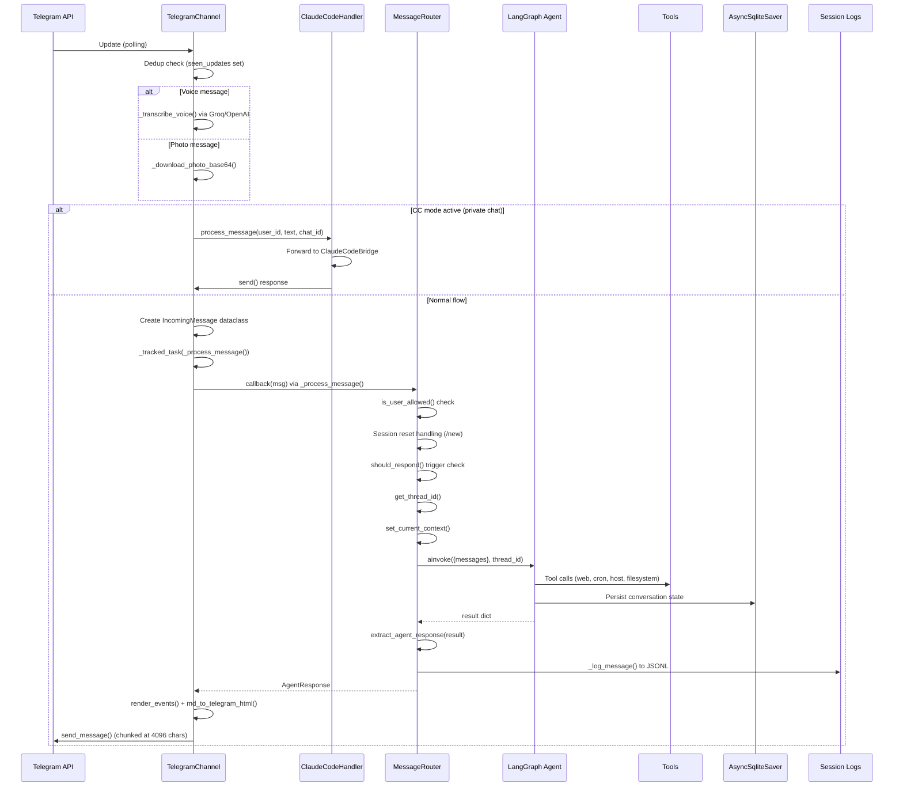
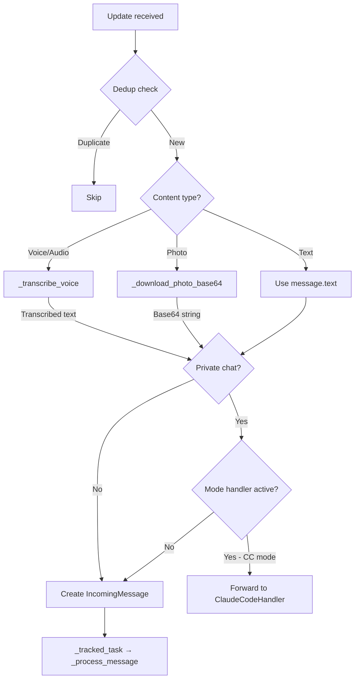
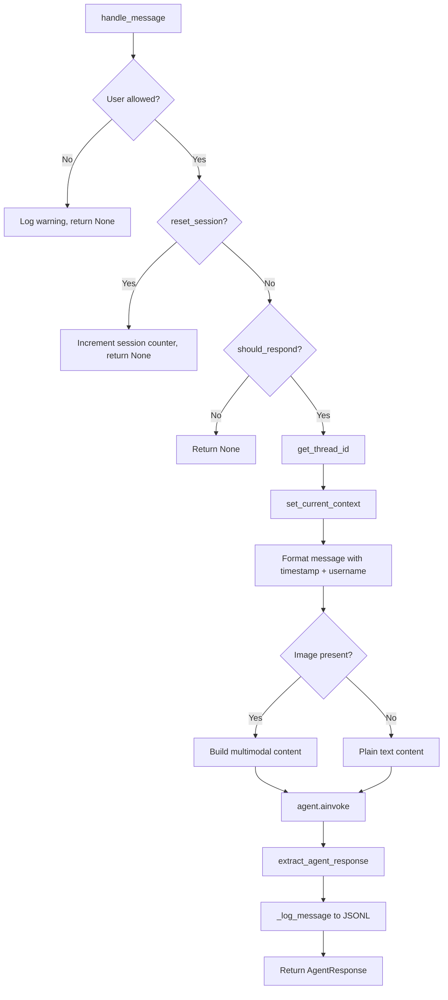
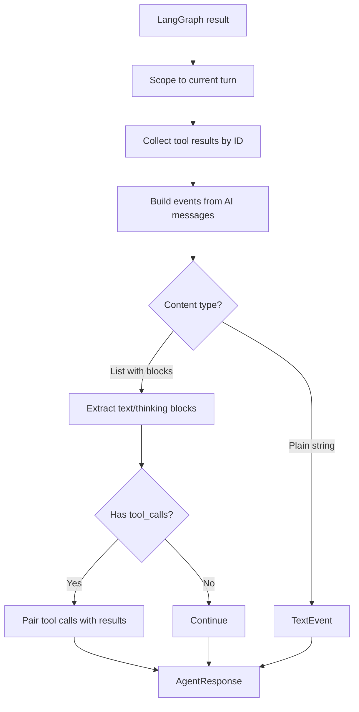
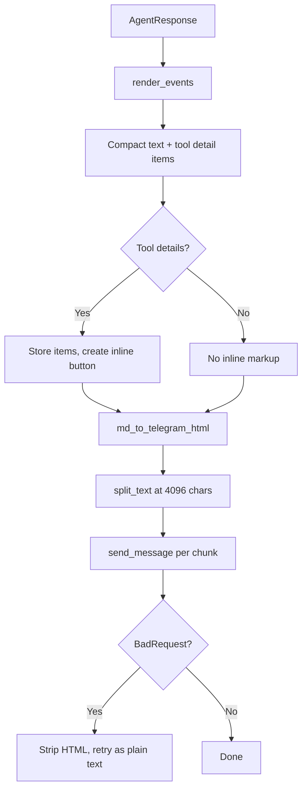
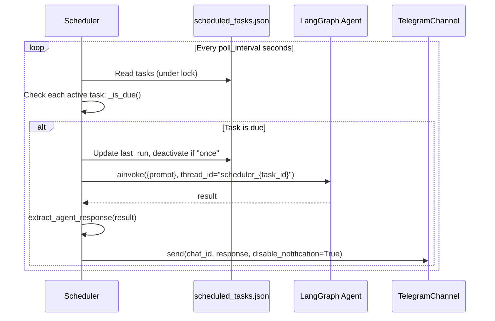

# Message Flow

This page traces the complete lifecycle of a message through CianaParrot, from Telegram polling to response delivery.

## End-to-End Flow



## Step-by-Step Breakdown

### 1. Telegram Polling

`TelegramChannel.start()` initializes the `python-telegram-bot` Application with manual polling (no `run_polling()`) to share the asyncio event loop:

```python
# src/channels/telegram/channel.py
await self._app.initialize()
await self._app.start()
await self._app.updater.start_polling(allowed_updates=Update.ALL_TYPES)
```

Registered handlers: `/start`, `/help`, `/new`, `/status`, mode handler commands (e.g. `/cc`), callback queries, and a catch-all `MessageHandler` for text, voice, audio, and photo messages.

### 2. Deduplication and Media Processing

`_handle_message()` is the entry point for all non-command messages:



**Dedup** uses a `seen_updates` set capped at `MAX_SEEN_UPDATES = 1000`. When the set exceeds this limit, older update IDs are pruned.

**Voice transcription** downloads the audio file to memory, then calls the configured transcription provider (Groq Whisper or OpenAI Whisper). If transcription is not configured, the user receives an error message.

**Photo download** takes the highest-resolution photo from the `message.photo` list, downloads it to a `BytesIO` buffer, and base64-encodes it.

### 3. Mode Handler Intercept

Before creating an `IncomingMessage`, the channel checks if any mode handler is active for the user (private chats only):

```python
# src/channels/telegram/channel.py
if is_private:
    for handler in self._mode_handlers:
        if handler.is_active(user_id):
            # Photo → reject
            # Voice → transcribe then forward
            # Text → forward directly
            self._tracked_task(handler.process_message(user_id, text, chat.id))
            return
```

Additionally, reply keyboard button text is matched **before** the mode check. The buttons "Exit CC" and "Conversations" are intercepted and routed to `exit_with_keyboard_remove()` or `show_menu()` respectively.

When in Claude Code mode, messages bypass the router entirely and go through `ClaudeCodeBridge.send_message()`, which constructs a `claude -p --output-format stream-json --verbose` command and sends it to the gateway or local CLI.

### 4. IncomingMessage Creation

For normal (non-mode) messages, an `IncomingMessage` dataclass is created:

```python
@dataclass
class IncomingMessage:
    channel: str               # "telegram"
    chat_id: str               # Telegram chat ID as string
    user_id: str               # Telegram user ID as string
    user_name: str             # user.first_name
    text: str                  # Message text (or transcribed voice, or photo caption)
    is_private: bool           # True for DMs
    reply_to: str | None       # (unused currently)
    file_path: str | None      # (unused currently)
    reset_session: bool        # True for /new command
    message_id: str | None     # Telegram message ID
    image_base64: str | None   # Base64-encoded photo data
    image_mime_type: str        # Default "image/jpeg"
```

Processing happens in a background task via `_tracked_task()` so the Telegram handler returns immediately without blocking the polling loop.

### 5. MessageRouter.handle_message()



**User allowlist**: Loaded from `config.channels.telegram.allowed_users`. Empty list means allow all.

**Trigger detection** (`should_respond()`):

- **Private chats**: Always respond. Text is passed through unchanged.
- **Group chats**: Message must start with the configured trigger (default `@Ciana`). The trigger prefix is stripped from the text before passing to the agent.

**Thread ID mapping** (`get_thread_id()`):

- Base format: `{channel}_{chat_id}` (e.g., `telegram_123456`)
- After session resets: `{channel}_{chat_id}_s{N}` (e.g., `telegram_123456_s3`)
- The counter is persisted in `data/session_counters.json` and synced with existing checkpoint threads at startup to prevent collisions.

**Context propagation**: `set_current_context(channel, chat_id)` sets `ContextVar` values so that when the agent calls `schedule_task`, the new task records which channel/chat to send results to.

**Message formatting**: The user message is wrapped with timestamp and username:
```
[2026-02-24 14:30 UTC] [Emanuele]: What's the weather?
```

For images, content is structured as a multimodal list:
```python
[
    {"type": "text", "text": "[timestamp] [user]: caption"},
    {"type": "image_url", "image_url": {"url": "data:image/jpeg;base64,..."}}
]
```

### 6. Agent Invocation

The agent is invoked via LangGraph's `ainvoke()`:

```python
result = await self._agent.ainvoke(
    {"messages": [{"role": "user", "content": content}]},
    config={"configurable": {"thread_id": thread_id}},
)
```

The `thread_id` enables LangGraph to maintain conversation history across messages. Conversation state is persisted in `data/checkpoints.db` via `AsyncSqliteSaver`.

The agent has access to:

- **Custom tools**: `web_search`, `web_fetch`, `schedule_task`, `list_tasks`, `cancel_task`, and (if gateway enabled) `host_execute`
- **MCP tools**: Loaded via `MultiServerMCPClient` from `config.mcp_servers`
- **DeepAgents filesystem tools**: `read_file`, `write_file`, `edit_file`, `ls`, `glob`, `grep` (sandboxed to `workspace/`)
- **DeepAgents shell execution**: Allowlisted commands via `WorkspaceShellBackend`
- **Skills**: Auto-registered tools from `workspace/skills/` directories

### 7. Response Extraction

`extract_agent_response()` processes the raw LangGraph result:



The result is an `AgentResponse` containing:

- `text`: The final text from the last `TextEvent`
- `events`: Ordered list of `ThinkingEvent`, `ToolCallEvent`, and `TextEvent` instances

### 8. Response Rendering and Delivery



**render_events()** produces a compact text representation with tool calls shown as abbreviated summaries, and a separate list of tool detail items that can be expanded via an inline keyboard button.

**md_to_telegram_html()** (`src/channels/telegram/formatting.py`) converts Markdown to Telegram-compatible HTML. It protects code blocks, converts inline formatting (`**bold**`, `*italic*`, `` `code` ``), and handles links and lists.

**Chunking** splits the HTML text at the Telegram message length limit of **4096 characters**, respecting HTML tag boundaries.

**Error handling**: If Telegram returns a `BadRequest` (usually malformed HTML), the text is stripped of all HTML tags and retried as plain text.

### 9. Session Logging

Every user message and agent response is logged as JSONL to `data/sessions/{thread_id}.jsonl`:

```json
{"role": "user", "content": "What's the weather?", "ts": "2026-02-24T14:30:00+00:00", "channel": "telegram", "user_id": "123456"}
{"role": "assistant", "content": "The weather in...", "ts": "2026-02-24T14:30:05+00:00", "channel": "telegram", "user_id": null}
```

## Scheduled Task Execution Flow



The scheduler uses the same `asyncio.Lock` as the cron tools to prevent races on the JSON file. Due tasks are identified under the lock, but execution happens outside it via parallel `create_task()` calls. One-shot tasks (`type: "once"`) are set to `active: false` after execution.
