# Persistence

CianaParrot persists state across container restarts through several mechanisms. All persistent data lives in the `data/` directory (runtime state) or `workspace/` directory (agent sandbox), both mounted as Docker volumes.

## Storage Map


## Conversation Checkpoints

**File**: `data/checkpoints.db`
**Format**: SQLite database
**Library**: `langgraph.checkpoint.sqlite.aio.AsyncSqliteSaver`

LangGraph's `AsyncSqliteSaver` persists the full conversation state (message history, tool call results, intermediate states) for each thread. This enables:

- Conversation continuity across container restarts
- Independent conversation threads per chat
- Session isolation after `/new` resets

### Thread ID Format

```
{channel}_{chat_id}             # Initial session (e.g., telegram_123456)
{channel}_{chat_id}_s{N}       # After N session resets (e.g., telegram_123456_s3)
scheduler_{task_id}             # Scheduler-initiated threads
```

### Lifecycle

```mermaid
sequenceDiagram
    participant Agent as agent.py
    participant Saver as AsyncSqliteSaver
    participant DB as checkpoints.db

    Note over Agent: Startup
    Agent->>DB: aiosqlite.connect("data/checkpoints.db")
    Agent->>Saver: AsyncSqliteSaver(conn)
    Agent->>Saver: setup() — create tables if needed

    Note over Agent: Per-message
    Agent->>Saver: ainvoke(..., config={"thread_id": "telegram_123_s2"})
    Saver->>DB: Read existing checkpoint for thread
    Saver->>DB: Write updated checkpoint after agent completes

    Note over Agent: Shutdown
    Agent->>DB: conn.close()
```



The checkpointer is passed to the agent via `create_deep_agent(checkpointer=checkpointer)` and to the `MessageRouter` for startup sync of session counters.

## Session Logs

**Directory**: `data/sessions/`
**Format**: JSONL (one JSON object per line)
**Filename**: `{thread_id}.jsonl`

Session logs provide a human-readable audit trail of all conversations, separate from the binary checkpoint database.

### Entry Format

```json
{
    "role": "user",
    "content": "What's the weather?",
    "ts": "2026-02-24T14:30:00.123456+00:00",
    "channel": "telegram",
    "user_id": "123456"
}
```

```json
{
    "role": "assistant",
    "content": "Based on the current forecast...",
    "ts": "2026-02-24T14:30:05.789012+00:00",
    "channel": "telegram",
    "user_id": null
}
```

| Field | Type | Description |
|-------|------|-------------|
| `role` | string | `"user"` or `"assistant"` |
| `content` | string | Message text (clean text for user, agent response text for assistant) |
| `ts` | string | ISO 8601 timestamp with UTC timezone |
| `channel` | string | Channel name (e.g., `"telegram"`) |
| `user_id` | string or null | User ID for user messages, `null` for assistant messages |

Logs are written by `MessageRouter._log_message()` via simple file append. Failures are logged as warnings but do not block message processing.

## Session Counters

**File**: `data/session_counters.json`
**Format**: JSON object (`{base_key: counter}`)
**Library**: `JsonStore` (`src/store.py`)

Tracks how many times `/new` (session reset) has been used per chat. The counter determines the `_s{N}` suffix in thread IDs.

### Sync with Checkpoints

```mermaid
flowchart TD
    A[MessageRouter.__init__] --> B[Load session_counters.json]
    B --> C[Connect to checkpoints.db]
    C --> D[SELECT DISTINCT thread_id FROM checkpoints]
    D --> E[For each thread_id with _s{N} suffix]
    E --> F{N > current counter?}
    F -->|Yes| G[Update counter to N]
    F -->|No| H[Skip]
    G --> I[Persist to session_counters.json]
```

This sync prevents counter collisions after scenarios like:
- Restoring a checkpoint database from backup
- Manual database manipulation
- Counter file corruption or deletion

### Example

```json
{
    "telegram_123456": 3,
    "telegram_789012": 1
}
```

This means chat `123456` has had 3 session resets (current thread: `telegram_123456_s3`) and chat `789012` has had 1 reset (current thread: `telegram_789012_s1`).

## Scheduled Tasks

**File**: `data/scheduled_tasks.json`
**Format**: JSON array of task objects
**Concurrency**: Protected by shared `asyncio.Lock` (accessed by both `Scheduler._check_and_run()` and `schedule_task`/`cancel_task` tools)

### Task Object Format

```json
{
    "id": "a1b2c3d4",
    "prompt": "Check the weather forecast and send me a summary",
    "type": "cron",
    "value": "0 8 * * *",
    "channel": "telegram",
    "chat_id": "123456",
    "created_at": "2026-02-24T10:00:00+00:00",
    "last_run": "2026-02-25T08:00:12+00:00",
    "active": true
}
```

| Field | Type | Description |
|-------|------|-------------|
| `id` | string | UUID prefix (first 8 chars) |
| `prompt` | string | Text sent to the agent when the task fires |
| `type` | string | `"cron"`, `"interval"`, or `"once"` |
| `value` | string | Cron expression, interval in seconds, or ISO timestamp |
| `channel` | string | Originating channel name |
| `chat_id` | string | Originating chat ID (results are sent back here) |
| `created_at` | string | ISO 8601 creation timestamp |
| `last_run` | string or null | ISO 8601 timestamp of last execution |
| `active` | boolean | `false` for cancelled or completed one-shot tasks |

### Task Types


### Concurrency Control

Both the `Scheduler` and the cron tools (`schedule_task`, `list_tasks`, `cancel_task`) share an `asyncio.Lock` obtained via `get_tasks_lock()`. This prevents race conditions when the scheduler reads/writes the file while the agent is simultaneously creating or cancelling tasks.


## Memory Files

**Directory**: `workspace/`
**Format**: Markdown
**Loaded by**: `create_cianaparrot_agent()` at startup

| File | Purpose | Git Status |
|------|---------|------------|
| `IDENTITY.md` | Agent's personality, name, and behavioral guidelines | Committed (template) |
| `AGENT.md` | Agent's capabilities, available tools, and usage instructions | Committed (template) |
| `MEMORY.md` | User's personal data, preferences, and context | **skip-worktree** (never committed) |

Memory files are passed to `create_deep_agent(memory=["IDENTITY.md", "AGENT.md", "MEMORY.md"])`. DeepAgents loads them as system-level context for the LLM, providing the agent with persistent knowledge about itself and the user.

`MEMORY.md` contains personal data and is protected by `git update-index --skip-worktree` to prevent accidental commits. After a fresh clone, this must be re-applied manually.

## Claude Code User States

**File**: `data/cc_user_states.json`
**Format**: JSON object (`{user_id: session_state}`)
**Library**: `JsonStore` (`src/store.py`)

Persists per-user Claude Code mode state so that active CC sessions survive container restarts.

### Entry Format

```json
{
    "123456": {
        "mode": "claude_code",
        "active_project": "2fUsers2fme2fProjects2fmyapp",
        "active_project_path": "/Users/me/Projects/myapp",
        "active_session_id": "abc12345-def6-7890-ghij-klmnopqrstuv",
        "active_model": "sonnet",
        "active_effort": "high"
    }
}
```

| Field | Type | Description |
|-------|------|-------------|
| `mode` | string | `"claude_code"` when in CC mode (entries with `"ciana"` are not persisted) |
| `active_project` | string | Encoded directory name in `~/.claude/projects/` |
| `active_project_path` | string | Real filesystem path to the project |
| `active_session_id` | string or null | Claude Code session UUID (null = new conversation) |
| `active_model` | string or null | Model override for this session |
| `active_effort` | string or null | Effort level override: `"low"`, `"medium"`, or `"high"` |

On startup, `ClaudeCodeBridge._restore_states()` reads all entries from the store and reconstructs `UserSession` objects. When a user exits CC mode, their entry is deleted from the store.

## Workspace Volume

The `workspace/` directory is the agent's sandboxed filesystem, mounted as a Docker volume:

```yaml
# docker-compose.yml
volumes:
  - ./workspace:/app/workspace
  - ~/Documents:/app/workspace/host/documents:ro
  - ~/Projects:/app/workspace/host/projects
```


With `virtual_mode=True`, all file paths passed to the agent's filesystem tools are resolved relative to `workspace/`. The agent cannot escape this directory. Host directories appear as subdirectories (e.g., `host/documents/report.pdf`), with read-only or read-write access controlled by the Docker mount flags.

## Data Flow Summary


