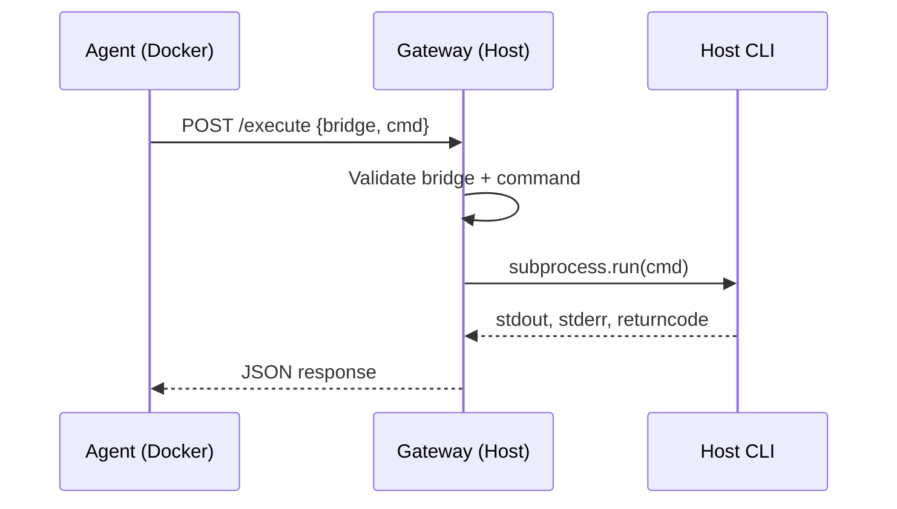

# Add a Gateway Bridge

This guide explains how to expose a host CLI tool to the agent through the gateway's bridge system. Bridges let the sandboxed Docker agent safely execute commands on your host machine.

---

## Introduction

The gateway is an HTTP server that runs on the host outside Docker. When the agent calls the `host_execute` tool, the request flows through the `GatewayClient` to the gateway server, which validates the command against per-bridge allowlists before executing it. Each bridge defines which commands are allowed and (optionally) which working directories are permitted.



---

## Prerequisites

- A working CianaParrot installation with the gateway running (`make gateway`)
- `GATEWAY_TOKEN` set in `.env`
- The CLI tool you want to bridge already installed on the host

---

## Step 1: Define the Bridge in config.yaml

Add an entry under `gateway.bridges` with the allowed commands and optional working directory restrictions:

```yaml title="config.yaml"
gateway:
  enabled: true
  url: "http://host.docker.internal:9842"
  token: "${GATEWAY_TOKEN}"
  bridges:
    my-bridge:
      allowed_commands:
        - "mycli"
        - "myhelper"
      allowed_cwd:
        - "~/myproject"
```

!!! info "How allowlists work"
    - `allowed_commands`: The **basename** of the first element in the command array must appear in this list. For example, if `allowed_commands: ["mycli"]`, then `mycli list`, `mycli search foo`, and `/usr/local/bin/mycli status` are all allowed -- but `othercli list` is rejected.
    - `allowed_cwd`: If specified, any `cwd` parameter must resolve to a path under one of these directories. If omitted, the command runs without a working directory override and `cwd` requests are rejected.

---

## Step 2: Understand the Pydantic Model

The bridge configuration is validated by `BridgeDefinition` in `src/config.py`:

```python title="src/config.py (reference)"
class BridgeDefinition(BaseModel):
    allowed_commands: list[str] = Field(default_factory=list)
    allowed_cwd: list[str] = Field(default_factory=list)
```

And it lives inside `GatewayConfig`:

```python title="src/config.py (reference)"
class GatewayConfig(BaseModel):
    enabled: bool = False
    url: Optional[str] = None
    token: Optional[str] = None
    port: int = 9842
    default_timeout: int = 30
    bridges: dict[str, BridgeDefinition] = Field(default_factory=dict)
```

No code changes are needed for a simple bridge -- the config-driven approach handles everything.

---

## Step 3: Restart the Gateway

After updating `config.yaml`, restart the gateway so it picks up the new bridge:

```bash
# Stop the existing gateway (Ctrl+C or kill the process)
# Then restart:
make gateway
```

The startup output should list your new bridge:

```
Host gateway on 0.0.0.0:9842
Bridges: claude-code, my-bridge
Auth: enabled
```

---

## Step 4: Test with curl

Verify the bridge is working before involving the agent:

=== "Health check"

    ```bash
    curl http://localhost:9842/health \
      -H "Authorization: Bearer $GATEWAY_TOKEN"
    ```

    Expected response:

    ```json
    {"status": "ok", "bridges": ["claude-code", "my-bridge"]}
    ```

=== "Execute a command"

    ```bash
    curl -X POST http://localhost:9842/execute \
      -H "Authorization: Bearer $GATEWAY_TOKEN" \
      -H "Content-Type: application/json" \
      -d '{"bridge": "my-bridge", "cmd": ["mycli", "--help"]}'
    ```

    Expected response:

    ```json
    {"stdout": "Usage: mycli [options] ...", "stderr": "", "returncode": 0}
    ```

=== "Rejected command"

    ```bash
    curl -X POST http://localhost:9842/execute \
      -H "Authorization: Bearer $GATEWAY_TOKEN" \
      -H "Content-Type: application/json" \
      -d '{"bridge": "my-bridge", "cmd": ["rm", "-rf", "/"]}'
    ```

    Expected response (403):

    ```json
    {"error": "command 'rm' not allowed for bridge 'my-bridge'"}
    ```

---

## Step 5: Use It from the Agent

Once the gateway is running with your bridge, the agent can call it via the `host_execute` tool:

```python
# The agent would invoke this tool call:
host_execute(bridge="my-bridge", command="mycli list")
```

In a Telegram conversation, the agent decides when to use `host_execute` based on the user's request and the tool's description. You can also create a skill that wraps the bridge for a more guided experience (see [Add a Skill](add-skill.md)).

---

## Step 6: (Optional) Create a Dedicated Bridge Class

For complex interactions (streaming output, session management, multi-step workflows), you can create a dedicated bridge class following the `ClaudeCodeBridge` pattern:

```
src/gateway/bridges/my_bridge/
    __init__.py
    bridge.py
```

```python title="src/gateway/bridges/my_bridge/bridge.py"
"""My bridge — manages stateful interactions with mycli."""

import logging
from ...client import GatewayClient

logger = logging.getLogger(__name__)


class MyBridge:
    """Stateful bridge for mycli interactions."""

    def __init__(self, config):
        self._client = GatewayClient(
            config.gateway.url, config.gateway.token
        )

    async def check_available(self) -> tuple[bool, str]:
        """Check if mycli is reachable through the gateway."""
        result = await self._client.execute(
            bridge="my-bridge", cmd=["mycli", "--version"]
        )
        if result.error:
            return False, result.error
        return True, result.stdout.strip()

    async def run_command(self, *args: str) -> str:
        """Run a mycli command and return output."""
        result = await self._client.execute(
            bridge="my-bridge", cmd=["mycli", *args]
        )
        if result.error:
            return f"Error: {result.error}"
        if result.returncode != 0:
            return f"Failed (exit {result.returncode}): {result.stderr}"
        return result.stdout
```

Wire it with a `setup_bridge()` factory in `__init__.py`:

```python title="src/gateway/bridges/my_bridge/__init__.py"
"""My bridge package."""

import logging
from .bridge import MyBridge

logger = logging.getLogger(__name__)


async def setup_bridge(config, channel) -> None:
    """Wire my bridge to a channel, if enabled."""
    # Check if bridge is configured
    if "my-bridge" not in config.gateway.bridges:
        return

    bridge = MyBridge(config)
    available, version = await bridge.check_available()
    if available:
        logger.info("My bridge ready: %s", version)
    else:
        logger.warning("My bridge not reachable: %s", version)
```

---

## Step 7: (Optional) Bridge-Gated Skills

Skills can declare a bridge dependency in their YAML frontmatter. The middleware (`src/middleware.py`) automatically filters out skills whose required bridges are not configured:

```yaml title="workspace/skills/my-skill/SKILL.md"
---
name: My Skill
description: Interacts with mycli on the host
requires_bridge: "my-bridge"
---
```

If `my-bridge` is not in `gateway.bridges`, this skill will be silently skipped at startup.

---

## Security Considerations

!!! warning "Security checklist"
    - **Minimize allowed commands**: Only allow the specific CLI tools the agent needs. Never add generic shells (`bash`, `sh`, `zsh`) or dangerous utilities (`rm`, `sudo`).
    - **Restrict working directories**: Use `allowed_cwd` to limit where commands can run. Paths are resolved via `os.path.realpath()`, so symlinks cannot bypass the restriction.
    - **Use strong tokens**: `GATEWAY_TOKEN` should be a long random string. The gateway uses `hmac.compare_digest()` for constant-time comparison.
    - **Timeout limits**: The gateway enforces a maximum timeout of 600 seconds (10 minutes). Timeout of 0 means no subprocess limit.

---

## Summary

| Step | What You Did |
|------|-------------|
| 1 | Added bridge definition to `config.yaml` |
| 2 | Reviewed the `BridgeDefinition` model (no code changes needed) |
| 3 | Restarted the gateway |
| 4 | Tested with curl |
| 5 | Verified agent can use `host_execute` with the new bridge |
| 6 | (Optional) Created a dedicated bridge class for stateful interactions |
| 7 | (Optional) Created bridge-gated skills |
