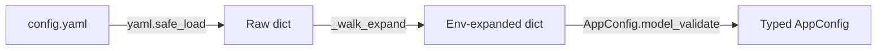

# Add a Config Section

This guide shows you how to add a new configuration section to CianaParrot using Pydantic v2 models, with automatic environment variable expansion and validation.

---

## Introduction

CianaParrot's configuration is managed by a single `config.yaml` file, parsed and validated through Pydantic v2 models in `src/config.py`. Environment variables are expanded automatically (`${VAR}` syntax), and all consumer code accesses config via typed attribute access (`config.my_section.api_key`).

The pattern:

1. Define a Pydantic `BaseModel` with typed fields, defaults, and validators
2. Add it as a field on `AppConfig`
3. Add the corresponding YAML section to `config.yaml`

---

## Prerequisites

- A working CianaParrot installation ([Installation Guide](../getting-started/installation.md))
- Basic familiarity with [Pydantic v2](https://docs.pydantic.dev/latest/)

---

## Step 1: Review the Config Architecture

The config loading pipeline:



Key pieces in `src/config.py`:

- **`_expand_env(value)`** -- Replaces `${VAR}` with `os.environ.get(VAR, "")`
- **`_walk_expand(obj)`** -- Recursively applies expansion to all strings in a dict/list
- **`_empty_str_to_none(v)`** -- Converts empty strings to `None` for optional fields (useful when env vars are not set)
- **`load_config()`** -- Loads YAML, expands env vars, validates with Pydantic

---

## Step 2: Define Your Config Model

Add a new Pydantic model to `src/config.py`:

```python title="src/config.py"
class NotificationConfig(BaseModel):
    """Configuration for the notification system."""
    enabled: bool = False
    webhook_url: Optional[str] = None
    max_retries: int = 3
    timeout: int = 10

    @field_validator("webhook_url", mode="before")
    @classmethod
    def _empty_to_none(cls, v: Any) -> Optional[str]:
        return _empty_str_to_none(v)  # (1)!

    @field_validator("max_retries")
    @classmethod
    def _check_retries(cls, v: int) -> int:
        if v < 0:
            raise ValueError("max_retries must be >= 0")
        return v

    @field_validator("timeout")
    @classmethod
    def _check_timeout(cls, v: int) -> int:
        if v < 1:
            raise ValueError("timeout must be >= 1")
        return v
```

1. The `_empty_str_to_none` helper is important for env-var-backed fields. When `${MY_WEBHOOK_URL}` is not set, it expands to `""`, which this validator converts to `None`.

!!! tip "Common field patterns"
    | Field Type | Pattern |
    |-----------|---------|
    | Optional string from env var | `Optional[str] = None` + `_empty_str_to_none` validator |
    | Boolean toggle | `bool = False` (YAML `true`/`false`) |
    | Bounded integer | `int = default` + range-checking validator |
    | String enum | `str = "default"` + set-membership validator |
    | List from config | `list[str] = Field(default_factory=list)` |

---

## Step 3: Add to AppConfig

Register your model as a field on the root config class:

```python title="src/config.py (modify AppConfig)"
class AppConfig(BaseModel):
    agent: AgentConfig = Field(default_factory=AgentConfig)
    provider: ProviderConfig = Field(default_factory=ProviderConfig)
    channels: ChannelsConfig = Field(default_factory=ChannelsConfig)
    scheduler: SchedulerConfig = Field(default_factory=SchedulerConfig)
    mcp_servers: dict[str, dict[str, Any]] = Field(default_factory=dict)
    skills: SkillsConfig = Field(default_factory=SkillsConfig)
    web: WebConfig = Field(default_factory=WebConfig)
    transcription: TranscriptionConfig = Field(default_factory=TranscriptionConfig)
    gateway: GatewayConfig = Field(default_factory=GatewayConfig)
    claude_code: ClaudeCodeConfig = Field(default_factory=ClaudeCodeConfig)
    logging: LoggingConfig = Field(default_factory=LoggingConfig)
    notifications: NotificationConfig = Field(default_factory=NotificationConfig)  # new
```

!!! important "`default_factory` is required"
    Use `Field(default_factory=NotificationConfig)` so that `config.yaml` files without a `notifications:` section still work -- the model creates itself with defaults.

---

## Step 4: Add the YAML Section

Add the configuration to `config.yaml`:

```yaml title="config.yaml"
notifications:
  enabled: true
  webhook_url: "${NOTIFICATION_WEBHOOK_URL}"
  max_retries: 3
  timeout: 10
```

And add the secret to `.env`:

```dotenv title=".env"
NOTIFICATION_WEBHOOK_URL=https://hooks.example.com/my-webhook
```

!!! warning "Never commit secrets"
    The `.env` file is in `.gitignore`. Put API keys, tokens, and URLs containing credentials in `.env` and reference them via `${VAR}` in `config.yaml`.

---

## Step 5: Access the Config

In your code, access the typed config via the `AppConfig` instance:

```python title="src/tools/notifications.py (example usage)"
from ..config import AppConfig


def init_notifications(config: AppConfig) -> None:
    if not config.notifications.enabled:
        return
    webhook = config.notifications.webhook_url
    if not webhook:
        logger.warning("Notifications enabled but no webhook_url configured")
        return
    timeout = config.notifications.timeout
    # ... initialize notification client ...
```

All field access is fully typed -- your IDE will autocomplete `config.notifications.webhook_url` and type-check the result as `Optional[str]`.

---

## Step 6: Test It

### Unit test for validation

```python title="tests/test_config.py"
import pytest
from src.config import NotificationConfig


def test_defaults():
    """Config should have sensible defaults."""
    cfg = NotificationConfig()
    assert cfg.enabled is False
    assert cfg.webhook_url is None
    assert cfg.max_retries == 3
    assert cfg.timeout == 10


def test_empty_string_becomes_none():
    """Empty webhook_url should be converted to None."""
    cfg = NotificationConfig(webhook_url="")
    assert cfg.webhook_url is None


def test_valid_config():
    """Valid values should be accepted."""
    cfg = NotificationConfig(
        enabled=True,
        webhook_url="https://hooks.example.com/test",
        max_retries=5,
        timeout=30,
    )
    assert cfg.enabled is True
    assert cfg.webhook_url == "https://hooks.example.com/test"


def test_invalid_retries():
    """Negative retries should be rejected."""
    with pytest.raises(ValueError, match="max_retries"):
        NotificationConfig(max_retries=-1)


def test_invalid_timeout():
    """Zero timeout should be rejected."""
    with pytest.raises(ValueError, match="timeout"):
        NotificationConfig(timeout=0)
```

### Test with full config loading

```python title="tests/test_config_loading.py"
from src.config import load_config


def test_missing_section_uses_defaults(tmp_path):
    """A config.yaml without the notifications section should still load."""
    config_file = tmp_path / "config.yaml"
    config_file.write_text("provider:\n  name: anthropic\n")

    cfg = load_config(str(config_file))
    assert cfg.notifications.enabled is False
    assert cfg.notifications.webhook_url is None
```

### Run the tests

```bash
make test
```

---

## Nested Config Models

For more complex configurations, nest models:

```python title="src/config.py (nested example)"
class RetryPolicy(BaseModel):
    max_retries: int = 3
    backoff_factor: float = 1.5


class NotificationConfig(BaseModel):
    enabled: bool = False
    webhook_url: Optional[str] = None
    retry: RetryPolicy = Field(default_factory=RetryPolicy)
```

```yaml title="config.yaml"
notifications:
  enabled: true
  webhook_url: "${NOTIFICATION_WEBHOOK_URL}"
  retry:
    max_retries: 5
    backoff_factor: 2.0
```

Access: `config.notifications.retry.max_retries`

---

## Summary

| Step | What You Did |
|------|-------------|
| 1 | Reviewed the config loading pipeline |
| 2 | Defined a Pydantic model with validators |
| 3 | Added the model as a field on `AppConfig` |
| 4 | Added the YAML section and env var references |
| 5 | Accessed the config via typed attribute access |
| 6 | Wrote validation and loading tests |
