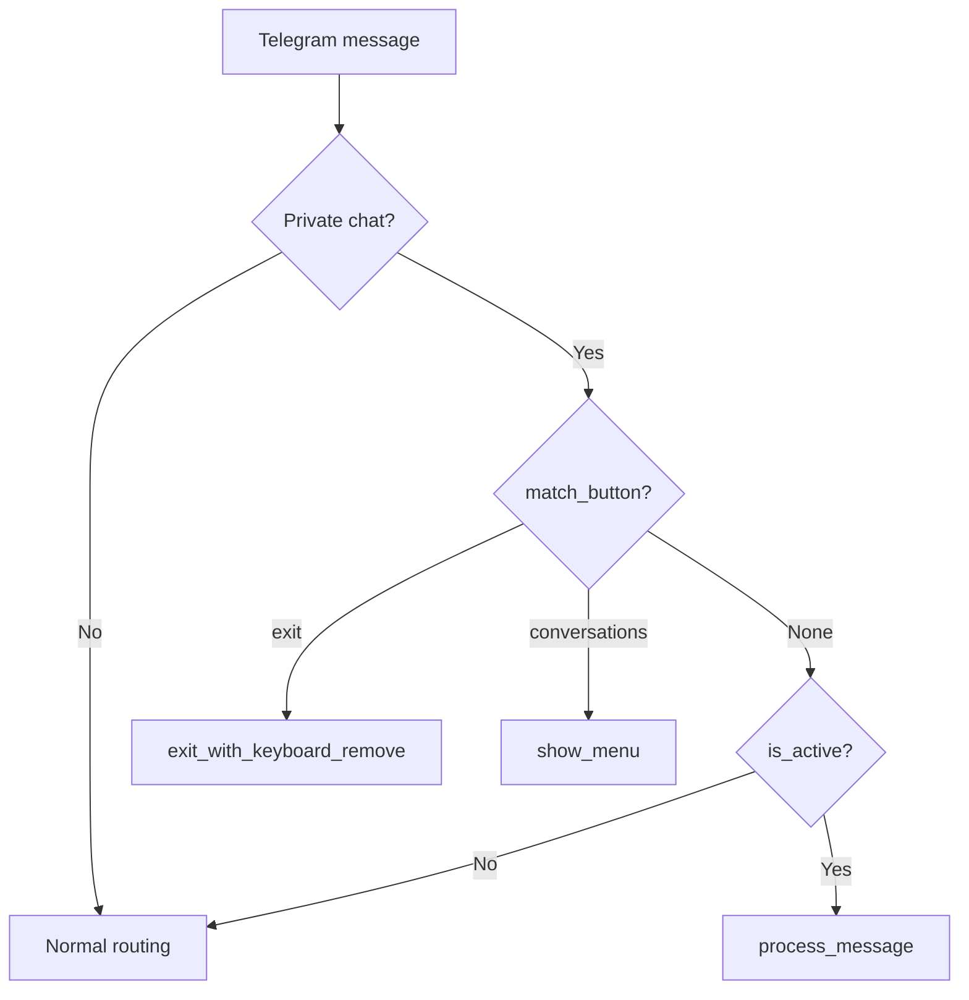

# Add a Mode Handler

This guide explains how to create a Telegram mode handler -- a component that intercepts messages when a user is in a specific mode, bypassing the normal agent flow.

---

## Introduction

Mode handlers give you full control over the user experience for a specific feature. When a user enters a mode (e.g., via `/cc` for Claude Code), all their subsequent messages are routed to the mode handler instead of the main agent. The handler manages its own UI (inline keyboards, reply keyboards, pagination) and communicates directly with the user.

The existing example is `ClaudeCodeHandler` (`src/channels/telegram/handlers/claude_code.py`), which implements a complete Telegram UI for interacting with Claude Code sessions.

---

## Prerequisites

- A working CianaParrot installation ([Installation Guide](../getting-started/installation.md))
- Familiarity with [python-telegram-bot v22+](https://python-telegram-bot.readthedocs.io/)
- Understanding of the [channel adapter pattern](add-channel.md)

---

## Step 1: Understand the ModeHandler Protocol

The `ModeHandler` protocol is defined in `src/channels/telegram/channel.py`:

```python title="src/channels/telegram/channel.py (reference)"
@runtime_checkable
class ModeHandler(Protocol):
    """Protocol for mode handlers (Claude Code, etc.)."""
    name: str

    def register(self) -> None: ...
    def is_active(self, user_id: str) -> bool: ...
    def match_button(self, text: str) -> str | None: ...
    async def process_message(self, user_id: str, text: str, chat_id: int) -> None: ...
    async def exit_with_keyboard_remove(self, user_id: str, chat_id: str) -> None: ...
    async def show_menu(self, user_id: str, chat_id: str) -> None: ...
    def get_commands(self) -> list[tuple[str, str]]: ...
    def get_help_lines(self) -> list[str]: ...
```

Each method's role:

| Method | When It's Called | Purpose |
|--------|-----------------|---------|
| `register()` | During `channel.start()` | Add command and callback handlers to the Telegram app |
| `is_active(user_id)` | Every incoming private message | Returns `True` if this user is currently in this mode |
| `match_button(text)` | Before mode check, on text messages | Matches ReplyKeyboard buttons; return `"exit"` or `"conversations"` (or `None`) |
| `process_message(...)` | When mode is active | Handle the user's message (instead of routing to the agent) |
| `exit_with_keyboard_remove(...)` | When user taps the exit button | Clean up mode state and remove the reply keyboard |
| `show_menu(...)` | When user taps the conversations button | Show a navigation menu (project list, conversation list, etc.) |
| `get_commands()` | During `channel.start()` | Return bot menu commands (e.g., `[("mymode", "Enter my mode")]`) |
| `get_help_lines()` | When `/help` is called | Return help text lines for this mode |

---

## Step 2: Create the Handler

Create a new handler file:

```
src/channels/telegram/handlers/
    __init__.py          # (may already exist)
    claude_code.py       # (existing reference)
    my_mode.py           # (new)
```

```python title="src/channels/telegram/handlers/my_mode.py"
"""My mode handler for Telegram."""

import logging
from typing import Optional

from telegram import (
    KeyboardButton,
    ReplyKeyboardMarkup,
    ReplyKeyboardRemove,
    Update,
)
from telegram.ext import (
    CommandHandler,
    ContextTypes,
)

logger = logging.getLogger(__name__)

# Reply keyboard button labels
BTN_EXIT = "Exit My Mode"
BTN_MENU = "Menu"


def _reply_keyboard() -> ReplyKeyboardMarkup:
    """Persistent reply keyboard shown while in this mode."""
    return ReplyKeyboardMarkup(
        [[KeyboardButton(BTN_MENU), KeyboardButton(BTN_EXIT)]],
        resize_keyboard=True,
        is_persistent=True,
        input_field_placeholder="Type a message...",
    )


class MyModeHandler:
    """Handles /mymode command and mode-intercepted messages.

    Implements the ModeHandler protocol for TelegramChannel.
    """

    name = "mymode"

    def __init__(self, app, send_fn):
        self._app = app
        self._send = send_fn
        # Track which users are in this mode
        self._active_users: set[str] = set()

    # --- Protocol methods ---

    def register(self) -> None:
        """Register command handlers on the Telegram app."""
        self._app.add_handler(CommandHandler("mymode", self._cmd_mymode))

    def is_active(self, user_id: str) -> bool:
        """Return True if user is currently in this mode."""
        return user_id in self._active_users

    def match_button(self, text: str) -> Optional[str]:
        """Check if text matches a ReplyKeyboard button."""
        stripped = text.strip()
        if stripped == BTN_EXIT:
            return "exit"
        if stripped == BTN_MENU:
            return "conversations"
        return None

    async def process_message(self, user_id: str, text: str, chat_id: int) -> None:
        """Handle a message while in this mode."""
        str_chat_id = str(chat_id)

        # Your custom logic here
        response = f"[My Mode] You said: {text}"

        await self._send(
            str_chat_id,
            response,
            reply_markup=_reply_keyboard(),
        )

    async def exit_with_keyboard_remove(self, user_id: str, chat_id: str) -> None:
        """Exit this mode and remove the reply keyboard."""
        self._active_users.discard(user_id)
        await self._send(
            chat_id,
            "Exited my mode. Messages go to Ciana again.",
            reply_markup=ReplyKeyboardRemove(),
        )

    async def show_menu(self, user_id: str, chat_id: str) -> None:
        """Show a menu or navigation view."""
        await self._send(
            chat_id,
            "<b>My Mode Menu</b>\n\nSend a message or tap Exit.",
            reply_markup=_reply_keyboard(),
        )

    def get_commands(self) -> list[tuple[str, str]]:
        """Return bot menu commands for this handler."""
        return [("mymode", "Enter my mode")]

    def get_help_lines(self) -> list[str]:
        """Return help text lines."""
        return ["/mymode - Enter my custom mode"]

    # --- Command handler ---

    async def _cmd_mymode(self, update: Update,
                          context: ContextTypes.DEFAULT_TYPE) -> None:
        """Handle the /mymode command."""
        chat = update.effective_chat
        user = update.effective_user

        if chat.type != "private":
            await update.message.reply_text(
                "This mode is only available in private chats.")
            return

        user_id = str(user.id) if user else "unknown"

        if self.is_active(user_id):
            await update.message.reply_text(
                "You're already in my mode. Send a message or tap Exit.",
                reply_markup=_reply_keyboard(),
            )
            return

        # Enter mode
        self._active_users.add(user_id)
        await update.message.reply_text(
            "<b>My Mode Active</b>\n\nAll messages now go to my mode handler.",
            parse_mode="HTML",
            reply_markup=_reply_keyboard(),
        )
```

---

## Step 3: Wire It with a Setup Function

Create a setup function that follows the `setup_bridge()` pattern. This is the factory that creates the handler and registers it on the channel:

=== "Simple registration (no bridge)"

    Wire directly in `main.py`:

    ```python title="src/main.py (add after setup_bridge call)"
    from .channels.telegram.handlers.my_mode import MyModeHandler

    # Inside main(), after the Telegram channel is created:
    if config.channels.telegram.enabled:
        tg = TelegramChannel(tg_config)

        await setup_bridge(config, tg)

        # Register my mode handler
        tg.register_mode_handler(lambda app, send: MyModeHandler(app, send))

        # ... rest of wiring ...
    ```

=== "With a bridge dependency"

    Create a setup function like `setup_bridge()`:

    ```python title="src/gateway/bridges/my_bridge/__init__.py"
    """My bridge package."""

    import logging
    from .bridge import MyBridge

    logger = logging.getLogger(__name__)


    async def setup_bridge(config, channel) -> None:
        """Wire my bridge and mode handler to a channel."""
        if not config.my_section.enabled:
            return

        from ....channels.telegram.handlers.my_mode import MyModeHandler

        bridge = MyBridge(config)
        available, info = await bridge.check_available()
        if available:
            logger.info("My bridge ready: %s", info)
        else:
            logger.warning("My bridge not reachable: %s", info)

        channel.register_mode_handler(
            lambda app, send: MyModeHandler(bridge, app, send)
        )
    ```

---

## Step 4: Understand the Message Flow

When a user is in your mode, here is how messages flow through the system:



!!! important "Mode handlers are checked before normal routing"
    The channel checks `match_button()` first (for ReplyKeyboard taps), then `is_active()` for all mode handlers. The first active handler wins. This means your mode completely intercepts the user's messages -- the main agent never sees them.

---

## Step 5: Add Inline Keyboards (Optional)

For richer UIs, add `CallbackQueryHandler` in `register()` and handle callbacks:

```python title="src/channels/telegram/handlers/my_mode.py (additions)"
from telegram import InlineKeyboardButton, InlineKeyboardMarkup
from telegram.ext import CallbackQueryHandler


class MyModeHandler:
    # ... existing code ...

    def register(self) -> None:
        self._app.add_handler(CommandHandler("mymode", self._cmd_mymode))
        # Handle callback queries with "mymode:" prefix
        self._app.add_handler(CallbackQueryHandler(
            self._handle_callback, pattern=r"^mymode:"))

    async def _handle_callback(self, update: Update,
                                context: ContextTypes.DEFAULT_TYPE) -> None:
        query = update.callback_query
        data = query.data or ""

        if data == "mymode:action1":
            await query.answer("Action 1 executed")
            await query.message.edit_text("Action 1 done!")
        elif data == "mymode:action2":
            await query.answer("Action 2 executed")
            await query.message.edit_text("Action 2 done!")
        else:
            await query.answer()
```

!!! tip "Callback data prefix"
    Use a unique prefix for your callback data (e.g., `mymode:`) to avoid collisions with other handlers. The Claude Code handler uses `cc:`.

---

## Step 6: Test It

### Manual test

1. Start the bot: `make up`
2. Send `/mymode` in a private chat
3. Send a message -- it should be handled by your mode, not the agent
4. Tap "Exit My Mode" to return to normal

### Unit test

```python title="tests/test_my_mode_handler.py"
import pytest
from unittest.mock import AsyncMock, MagicMock

from src.channels.telegram.handlers.my_mode import MyModeHandler


@pytest.fixture
def handler():
    app = MagicMock()
    send = AsyncMock()
    return MyModeHandler(app, send)


def test_not_active_by_default(handler):
    assert handler.is_active("12345") is False


def test_match_button_exit(handler):
    assert handler.match_button("Exit My Mode") == "exit"


def test_match_button_menu(handler):
    assert handler.match_button("Menu") == "conversations"


def test_match_button_other(handler):
    assert handler.match_button("hello") is None


def test_get_commands(handler):
    cmds = handler.get_commands()
    assert ("mymode", "Enter my mode") in cmds
```

---

## Summary

| Step | What You Did |
|------|-------------|
| 1 | Reviewed the `ModeHandler` protocol (8 methods) |
| 2 | Created handler class implementing all protocol methods |
| 3 | Wired it via `register_mode_handler()` in `main.py` or a setup function |
| 4 | Understood the message interception flow |
| 5 | (Optional) Added inline keyboard callbacks |
| 6 | Tested via Telegram and unit tests |
