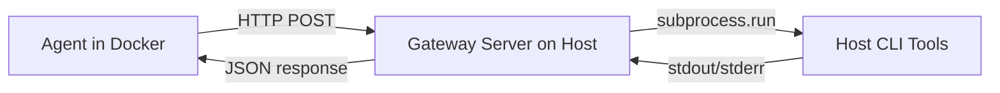

# Set Up the Gateway

The host gateway allows CianaParrot (running in Docker) to execute commands on the host machine through a secure HTTP bridge.



## Prerequisites

- CianaParrot running in Docker
- The gateway server runs on the **host machine** (not in Docker)
- A shared secret token for authentication

## Step 1: Set the Gateway Token

Add `GATEWAY_TOKEN` to your `.env` file:

```bash
# .env
GATEWAY_TOKEN="your-secret-token-here"
```

!!! warning
    The gateway server **refuses to start** without a token. This is a security requirement — the token prevents unauthorized command execution on your machine.

## Step 2: Start the Gateway Server

```bash
make gateway
```

This creates a Python venv, installs dependencies, and starts the server on port 9842.

You should see:

```
Gateway server listening on 0.0.0.0:9842
Registered bridges: claude-code, apple-reminders, spotify, ...
```

!!! tip
    Run the gateway in a separate terminal or as a background service. It needs to stay running while CianaParrot is active.

## Step 3: Configure Bridges

Each bridge defines which commands can be executed. Add them in `config.yaml`:

```yaml
gateway:
  enabled: true
  url: "http://host.docker.internal:9842"  # Docker → host
  token: "${GATEWAY_TOKEN}"
  port: 9842
  default_timeout: 30
  bridges:
    my-bridge:
      allowed_commands: ["mycli"]        # binary names
      allowed_cwd: ["~/myproject"]       # optional: restrict working directory
```

### Bridge Definition

| Field | Type | Description |
|-------|------|-------------|
| `allowed_commands` | `list[str]` | Binary names the agent can execute (e.g., `["git", "npm"]`) |
| `allowed_cwd` | `list[str]` | Directories the command can run in (empty = no restriction) |

### Example Bridges

```yaml
bridges:
  # Claude Code CLI
  claude-code:
    allowed_commands: ["claude"]
    allowed_cwd: ["~/Documents", "~/Projects"]

  # macOS Reminders
  apple-reminders:
    allowed_commands: ["remindctl"]

  # Spotify control
  spotify:
    allowed_commands: ["spogo"]

  # Custom script
  my-tool:
    allowed_commands: ["my-script.sh"]
    allowed_cwd: ["~/scripts"]
```

## Step 4: Enable Gateway in Config

Make sure gateway is enabled:

```yaml
gateway:
  enabled: true
  url: "http://host.docker.internal:9842"
  token: "${GATEWAY_TOKEN}"
```

Then restart CianaParrot:

```bash
make restart
```

## Step 5: Verify

### Health Check

```bash
curl http://localhost:9842/health \
  -H "Authorization: Bearer $GATEWAY_TOKEN"
```

Expected response:

```json
{
  "status": "ok",
  "bridges": ["claude-code", "apple-reminders", "spotify", ...]
}
```

### Test a Command

```bash
curl -X POST http://localhost:9842/execute \
  -H "Authorization: Bearer $GATEWAY_TOKEN" \
  -H "Content-Type: application/json" \
  -d '{"bridge": "my-bridge", "cmd": ["mycli", "--help"]}'
```

Expected response:

```json
{
  "stdout": "Usage: mycli [options] ...",
  "stderr": "",
  "returncode": 0
}
```

## Security Model

The gateway implements multiple security layers:

| Layer | Protection |
|-------|-----------|
| **HMAC Token Auth** | Bearer token must match `GATEWAY_TOKEN` |
| **Bridge Validation** | Only configured bridge names are accepted |
| **Command Allowlist** | Only listed binary names can execute (basename check) |
| **CWD Restriction** | Working directory validated against `allowed_cwd` (realpath resolution prevents traversal) |
| **Content Length** | Request body capped at 1 MB |
| **Timeout** | Subprocess timeout capped at 600 seconds |
| **No Shell** | Commands run via `subprocess.run(shell=False)` — no shell injection |

!!! info
    The gateway validates the **basename** of the command, not the full path. So `allowed_commands: ["git"]` allows both `git` and `/usr/bin/git`.

## How the Agent Uses It

The agent calls bridges through the `host_execute` tool:

```
host_execute(bridge="spotify", command="spogo play 'Bohemian Rhapsody'")
```

The tool:

1. Validates the bridge name exists in config
2. Parses the command string via `shlex.split()`
3. Sends it to the gateway via `GatewayClient.execute()`
4. Returns stdout (or error message) to the agent

## Troubleshooting

| Symptom | Cause | Fix |
|---------|-------|-----|
| "Cannot connect to host gateway" | Gateway not running | Run `make gateway` |
| "Gateway auth failed" | Token mismatch | Check `GATEWAY_TOKEN` in `.env` matches both sides |
| "unknown bridge" | Bridge not in config | Add bridge to `gateway.bridges` in `config.yaml` |
| "Command not allowed" | Binary not in allowlist | Add binary name to `allowed_commands` |
| "Forbidden (403)" | CWD not allowed | Add directory to `allowed_cwd` or remove CWD restriction |
| "Command timed out" | Long-running process | Increase `default_timeout` or pass higher `timeout` |
