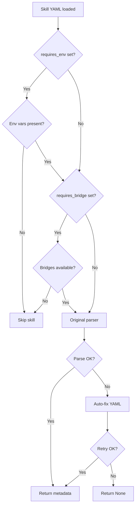

# Middleware API

**Module:** `src/middleware.py`

The middleware module patches DeepAgents' skill parser to add environment variable and bridge availability checks. It is imported as a side-effect in `src/agent.py`.

## init_middleware_bridges

```python
def init_middleware_bridges(gateway_config: GatewayConfig) -> None
```

Sets the available bridges for skill filtering. Called at startup in `src/main.py` when the gateway is enabled.

```python
# src/main.py
if config.gateway.enabled:
    init_middleware_bridges(config.gateway)
```

After initialization, skills that declare `requires_bridge` in their YAML frontmatter will be skipped if the required bridge is not configured.

## Skill Filtering

The module monkey-patches `deepagents.middleware.skills._parse_skill_metadata` with a custom implementation that adds two checks before delegating to the original parser.

### requires_env

```yaml
---
name: My Skill
requires_env: "MY_API_KEY"
---
```

The skill is skipped if any listed environment variables are not set. Supports both a single string and a list:

```yaml
requires_env: ["API_KEY_1", "API_KEY_2"]
```

### requires_bridge

```yaml
---
name: Spotify Skill
requires_bridge: "spotify"
---
```

The skill is skipped if any listed bridges are not in `gateway.bridges`. Supports both a single string and a list:

```yaml
requires_bridge: ["spotify", "sonos"]
```

## YAML Auto-Fix

If the original DeepAgents parser fails on a skill's frontmatter (common with unquoted values containing colons), the middleware attempts an automatic fix:

1. Detects unquoted values with embedded `: ` patterns
2. Wraps them in double quotes
3. Retries the original parser with the fixed content

## Internal Functions

| Function | Description |
|----------|-------------|
| `_extract_frontmatter_field(content, field)` | Extracts a single field from YAML frontmatter |
| `_extract_requires_env(content)` | Extracts `requires_env` from frontmatter |
| `_check_env_requirements(requires, skill_name)` | Returns `False` if env vars are missing |
| `_extract_requires_bridge(content)` | Extracts `requires_bridge` from frontmatter |
| `_check_bridge_requirements(requires, skill_name)` | Returns `False` if bridges are unavailable |
| `_robust_parse_skill_metadata(content, skill_path, directory_name)` | Replacement parser with filtering + auto-fix |

## How It Works


